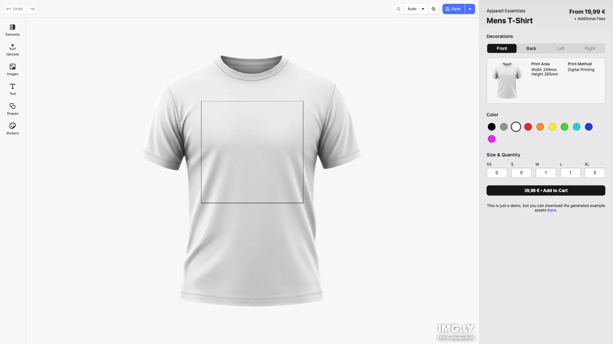

# T-Shirt Designer Starter Kit

Apparel Editor for creating print-ready design. Built with [CE.SDK](https://img.ly/creative-sdk) by [IMG.LY](https://img.ly), runs entirely in the browser with no server dependencies.

<p>
  <a href="https://img.ly/docs/cesdk/js/starterkits/t-shirt-designer-jwinqr/">Documentation</a>
</p>



## Getting Started

### Clone the Repository

```bash
git clone https://github.com/imgly/starterkit-t-shirt-designer-react-web.git
cd starterkit-t-shirt-designer-react-web
```

### Install Dependencies

```bash
npm install
```

### Download Assets

CE.SDK requires engine assets (fonts, icons, UI elements) served from your `public/` directory.

```bash
curl -O https://cdn.img.ly/packages/imgly/cesdk-js/$UBQ_VERSION$/imgly-assets.zip
unzip imgly-assets.zip -d public/
rm imgly-assets.zip
```

### Run the Development Server

```bash
npm run dev
```

Open `http://localhost:5173` in your browser.

## Configuration

### T-Shirt Product

The t-shirt product is configured in `src/product-catalog.ts`:

```typescript
export const PRODUCT_SAMPLES: ProductConfig[] = [
  {
    id: 'tshirt',
    label: 'Mens T-Shirt',
    designUnit: 'Inch',
    unitPrice: 19.99,
    areas: [
      { id: 'front', label: 'Front', pageSize: { width: 12, height: 12 } },
      { id: 'back', label: 'Back', pageSize: { width: 12, height: 12 } }
    ],
    colors: [
      /* 10 color options */
    ],
    sizes: [{ id: 'XS' }, { id: 'S' }, { id: 'M' }, { id: 'L' }, { id: 'XL' }]
  }
];
```

### Theming

```typescript
cesdk.ui.setTheme('dark'); // 'light' | 'dark' | 'system'
```

See [Theming](https://img.ly/docs/cesdk/js/user-interface/appearance/theming-4b0938/) for custom color schemes and styling.

### Localization

```typescript
cesdk.i18n.setTranslations({
  de: { 'common.save': 'Speichern' }
});
cesdk.i18n.setLocale('de');
```

See [Localization](https://img.ly/docs/cesdk/js/user-interface/localization-508e20/) for supported languages and translation keys.

## Architecture

```
src/
├── app/                          # Demo application
├── imgly/
│   ├── backdrop.ts               # Backdrop management
│   ├── config/
│   │   ├── actions.ts                # Export/import actions
│   │   ├── features.ts               # Feature toggles
│   │   ├── i18n.ts                   # Translations
│   │   ├── plugin.ts                 # Main configuration plugin
│   │   ├── settings.ts               # Engine settings
│   │   └── ui/
│   │       ├── canvas.ts                 # Canvas configuration
│   │       ├── components.ts             # Custom component registration
│   │       ├── dock.ts                   # Dock layout configuration
│   │       ├── index.ts                  # Combines UI customization exports
│   │       ├── inspectorBar.ts           # Inspector bar layout
│   │       ├── navigationBar.ts          # Navigation bar layout
│   │       └── panel.ts                  # Panel configuration
│   ├── constants.ts              # Configuration constants
│   ├── index.ts                  # Editor initialization function
│   ├── mask.ts                   # Mask handling
│   ├── page.ts                   # Scene and area management
│   └── types.ts                  # TypeScript type definitions
└── index.tsx                 # Application entry point
```

## Key Capabilities

- **Print Area Editing** – Front and back print areas
- **Color Customization** – 10 color options with real-time preview
- **Size Selection** – XS to XL with quantity counters
- **Real-time Mockup** – See designs on product mockups
- **E-commerce Cart** – Add to cart with price calculation
- **Export** – PDF and PNG export for all areas

## Prerequisites

- **Node.js v22+** with npm – [Download](https://nodejs.org/)
- **Supported browsers** – Chrome 114+, Edge 114+, Firefox 115+, Safari 15.6+

## Troubleshooting

| Issue                | Solution                                         |
| -------------------- | ------------------------------------------------ |
| Editor doesn't load  | Verify assets are accessible at `baseURL`        |
| Mockups don't appear | Check `public/assets/products/tshirt/` directory |
| Watermark appears    | Add your license key                             |

## Documentation

For complete integration guides and API reference, visit the [T-Shirt Designer Documentation](https://img.ly/docs/cesdk/js/starterkits/t-shirt-designer-jwinqr/).

## Demo Assets

The demo assets for this starter kit load from the IMG.LY CDN by default —
nothing to configure. If you want to own them — edit them, meet compliance
requirements, or remove the CDN dependency for production — eject them
(the archive contains only this kit's files):

```bash
# Download this starter kit's demo assets
curl -O https://staticimgly.com/imgly/cesdk-web-examples-data/1.80.0-rc.1/starterkit-t-shirt-designer/demo-assets.zip
unzip demo-assets.zip -d demo-assets
rm demo-assets.zip
```

Upload the extracted files to your own server or CDN, then point the app
at them via `.env`:

```bash
VITE_DEMO_ASSETS_BASE_URL=https://cdn.yourdomain.com/demo-assets
```

The default URL is the `DEMO_ASSETS_BASE_URL` constant in `src/app/product-catalog.ts` if you
prefer changing it in code.

The demo assets are intended for development and prototyping — replace
them with your own content or licensed stock assets before shipping to
production (see `DEMO-ASSETS-NOTICE.txt` in the download). This applies in
particular to media such as music tracks and stock imagery.

## License

This project is licensed under the MIT License - see the [LICENSE](LICENSE) file for details.

---

<p align="center">Built with <a href="https://img.ly/creative-sdk?utm_source=github&utm_medium=project&utm_campaign=starterkit-t-shirt-designer">CE.SDK</a> by <a href="https://img.ly?utm_source=github&utm_medium=project&utm_campaign=starterkit-t-shirt-designer">IMG.LY</a></p>
